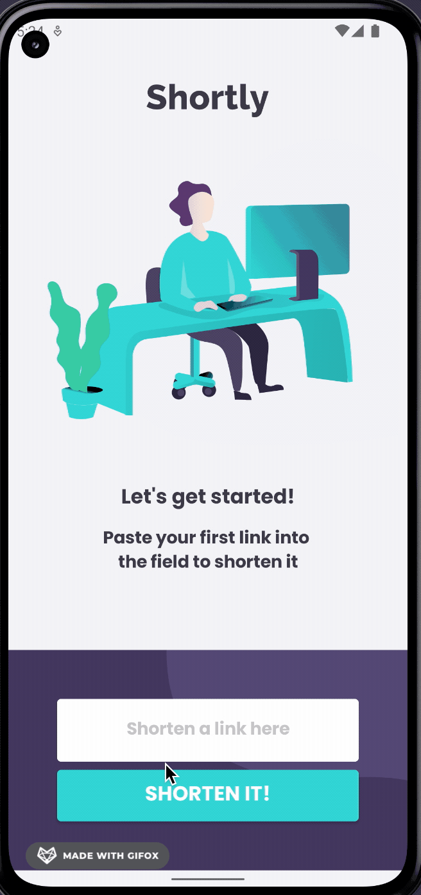

 **Important **: API used is down. Code is under maintenance migrating to new API's and libraries. 

### Shortly app

The purpose was to develop an Android application for URL shortening, integrate with the [shrtcode API](https://app.shrtco.de/docs), and get it looking as close to the design as possible. Check `/code-challenge-requirements` folder for more details about the requirements.

## Solution

The solution provided was focused on providing a base source code that follows the SOLID principles and showcasing the latest modern tools in Android development using Kotlin. 
The application should be easily extended to a complex application with more screens, features and data sources. 

-   Built using **Jetpack Compose** - a modern toolkit designed to simplify UI development combining a reactive programming model. 
-   **App architecture** with a separated UI layer and a Data Layer
-   **ViewModel** is used on the UI layer to store and manage UI-related logic. **Flows** are used to emit new states of the UI to the Composables. 
-   **Coroutines** are used to execute code asynchronously avoid blocking the UI thread.
-   Local storage using **Room**
-   **Hilt** for Dependency injection - allowing to scale the code easily withouth adding complexity and also being easier to switch between implementations for unit/ui testing or between development and production implementations. 
-   Android Jetpack's **Navigation** component integrated - though for now only one screen exists the code is already structured to add other navigation routes.
-   Unit and UI testing

## Future improvements

-   Migrate to Material 3.
-   Fix existing tests and improve code coverate.
-   The UI was built for small devices in mind. Though it should work reasonably in tablets, the UI is not otimized for it. An option can be to display the list in a grid for instance, instead of a simple vertical list. 
-   Proper error handling in the VM and use Snackbars to communicate in the UI.
-   Add more documentation and code comments.
-   Add missing Proguard rules. 
-   Create a Dark theme. Currently light and dark theme are the same. 

